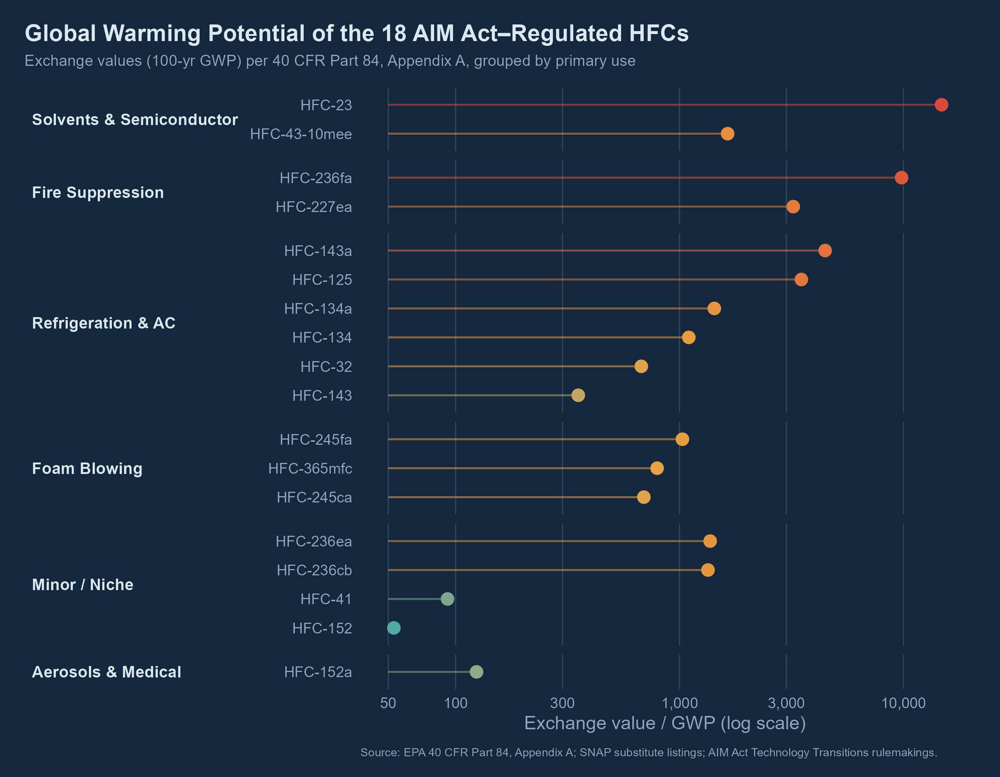
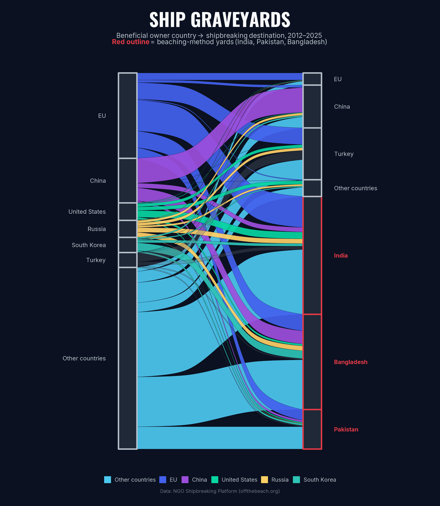

A collection of data visualizations spanning static graphics and interactive
explorables, built around environmental and regulatory datasets.

```{=html}
<div class="dataviz-grid">

  <div class="dataviz-card">
    <a href="dataviz/hfc_gwp_dotplot.png" target="_blank" class="dataviz-thumb">
      
    </a>
    <span class="project-tag">Static · PNG</span>
    <h4>GWP of AIM Act–Regulated HFCs</h4>
    <p>
      Dot plot of 100-yr GWP exchange values for the 18 HFCs regulated under the
      AIM Act, grouped by primary end use — refrigeration, foam blowing, fire
      suppression, and more — per 40 CFR Part 84, Appendix A.
    </p>
    <div class="card-links">
      <a href="dataviz/hfc_gwp_dotplot.png" target="_blank">View full size →</a>
    </div>
  </div>

  <div class="dataviz-card">
    <a href="dataviz/sankey_shipbreaking.png" target="_blank" class="dataviz-thumb">
      
    </a>
    <span class="project-tag">Static · PNG</span>
    <h4>Ship Graveyards</h4>
    <p>
      Sankey diagram tracing beneficial owner country to shipbreaking
      destination, 2012–2025, with beaching-method yards in India, Pakistan,
      and Bangladesh highlighted. Data: NGO Shipbreaking Platform.
    </p>
    <div class="card-links">
      <a href="dataviz/sankey_shipbreaking.png" target="_blank">View full size →</a>
    </div>
  </div>

  <div class="dataviz-card">
    <span class="project-tag">Interactive · HTML</span>
    <h4>GHGI Energy Sector — Source Tree</h4>
    <p>
      Explorable tree of U.S. Greenhouse Gas Inventory energy sector source
      categories, built to navigate the hierarchy of emission sources feeding
      into the national inventory.
    </p>
    <div class="card-links">
      <a href="dataviz/ghgi_tree_energy.html" target="_blank">Open interactive →</a>
    </div>
  </div>

  <div class="dataviz-card">
    <span class="project-tag">Interactive · HTML</span>
    <h4>18 Regulated HFCs</h4>
    <p>
      Infographic profiling the 18 HFCs regulated under the AIM Act / Kigali
      Amendment, with GWP values and end-use context for each substance.
    </p>
    <div class="card-links">
      <a href="dataviz/hfc_infographic.html" target="_blank">Open interactive →</a>
    </div>
  </div>

</div>
```
